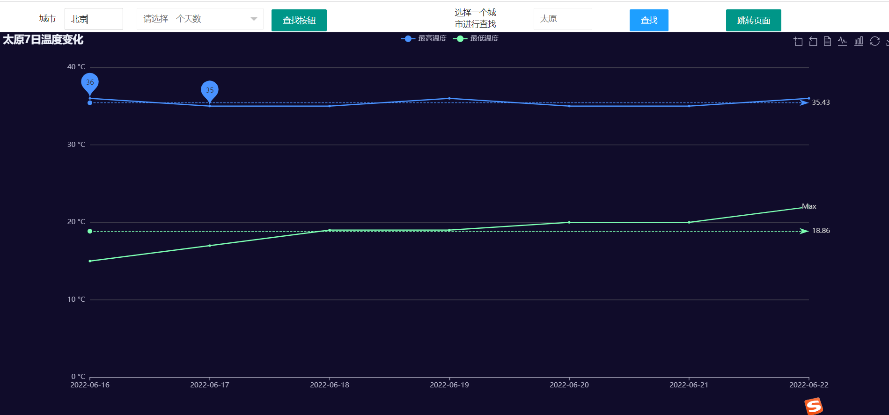
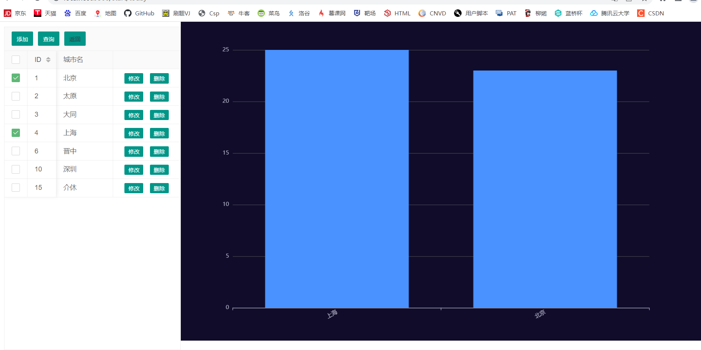

# weather_analysis
从网站上爬下天气数据，用echarts显示

**项目进行简单的HTML解析  获得一个城市近30天数据(可以修改天数)**


**左查询的数据库 右搜索框输入城市进行HTML解析**

**实时查询选中城市的温度**

1.执行sql导入数据库

2.修改配置文件 **application.yml**

```yml
datasource:
  driver-class-name: com.mysql.cj.jdbc.Driver(有的版本可能去掉cj)
  url: ${url}
  username: ${username}
  password: ${password}
```

3.运行项目 访问9300端口
